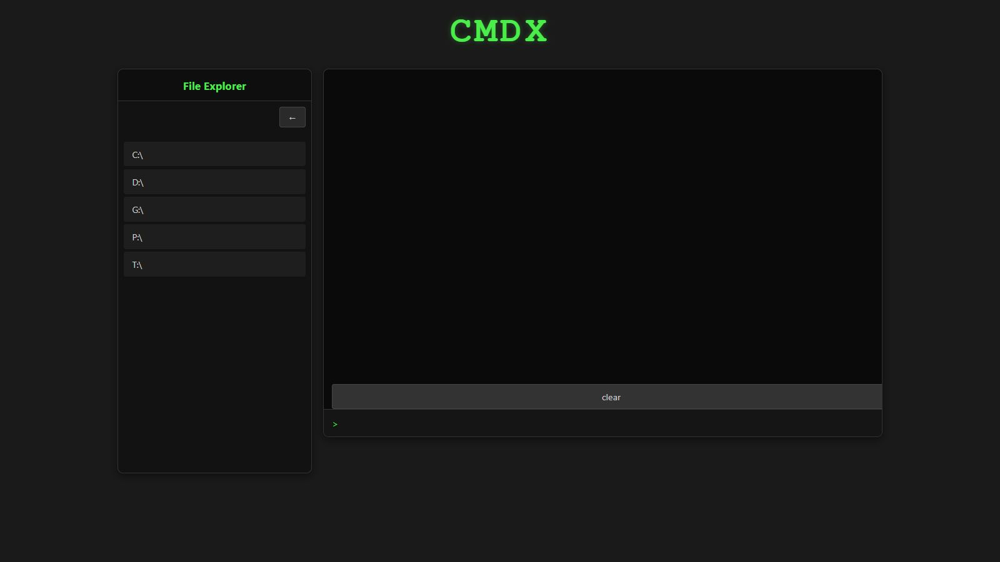
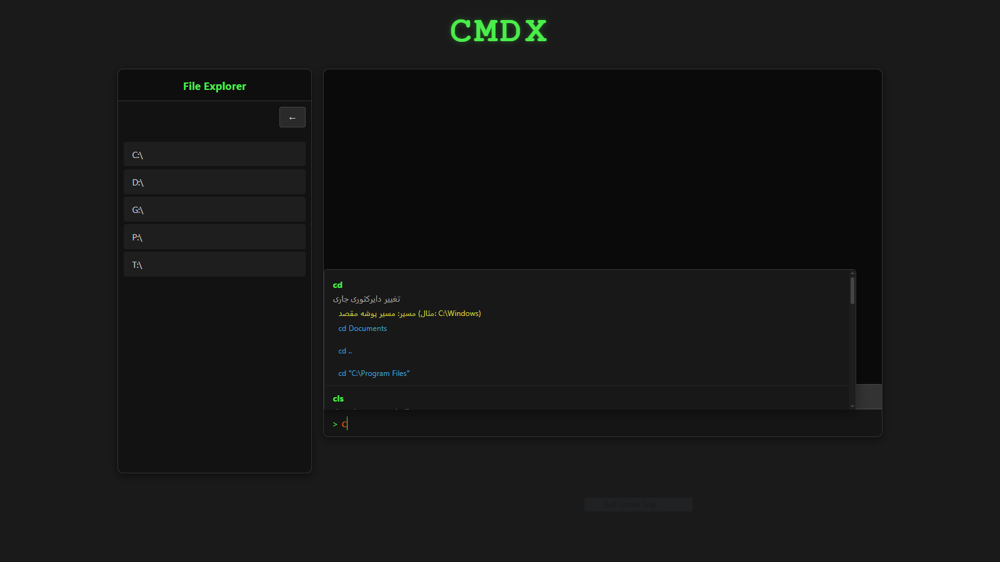

# CMDX Terminal


<div align="center">
  
  <h1>CMDX Terminal</h1>
  <p>Modern Windows Command Prompt Simulator with AI Assistant</p>
  
  <div>
    <a href="#farsi-section">فارسی</a> | 
    <a href="#english-section">English</a>
  </div>
  
  <br>
  
  <div>
    
    
    
  </div>
</div>

---

<a name="farsi-section"></a>

## 🌟 CMDX ترمینال - راهنمای فارسی

CMDX یک شبیه‌ساز مدرن ترمینال ویندوز با قابلیت‌های پیشرفته و رابط کاربری بهبود یافته است. این پروژه با ترکیب قدرت پایتون، جاوااسکریپت و هوش مصنوعی، تجربه‌ای مشابه Command Prompt ویندوز را با امکانات اضافه ارائه می‌دهد.
### ✨ ویژگی‌های کلیدی
- **شبیه‌سازی کامل محیط CMD** با پشتیبانی از دستورات واقعی
- **اکسپلورر فایل یکپارچه** برای پیمایش درایوها و پوشه‌ها
- **سیستم پیشنهاد هوشمند** با نمایش پارامترها و مثال‌های دستوری
- **دستیار هوش مصنوعی** برای یادگیری دستورات (با استفاده از OpenAI)
- **رابط کاربری مدرن** با تم تاریک و افکت‌های نئونی
- **پشتیبانی از اجرای بلادرنگ** دستورات طولانی
- **ریسپانسیو و سازگار** با تمام دستگاه‌ها

### 🚀 تکنولوژی‌های استفاده شده
| لایه       | تکنولوژی‌ها                     |
|------------|--------------------------------|
| Frontend   | HTML5, CSS3, JavaScript, jQuery |
| Backend    | Python, Flask                 |
| AI         | OpenAI API                    |
| Utilities  | Marked.js, Subprocess         |

### 📦 نحوه نصب و اجرا

#### پیش‌نیازها
- Python 3.8 یا بالاتر
- pip (مدیریت پکیج‌های پایتون)
- دسترسی به اینترنت (برای استفاده از هوش مصنوعی)

#### مراحل نصب
```bash
# 1. کلون کردن مخزن
git clone https://github.com/Reject-one/cmdx.git

# 2. ورود به دایرکتوری پروژه
cd cmdx

# 3. نصب نیازمندی‌ها
pip install flask openai

# 4. اجرای برنامه
python cmdx.py
```

### 🖥️ تصاویر از محیط برنامه

*شکل 1: محیط اصلی ترمینال و اکسپلورر فایل*


*شکل 2: سیستم پیشنهاد هوشمند دستورات*

### 🤝 مشارکت در پروژه
مشارکت‌های شما باعث رشد این پروژه می‌شود! برای مشارکت:
1. مخزن را Fork کنید
2. تغییرات خود را در یک Branch جدید ایجاد کنید
3. یک Pull Request ارسال کنید
### License 
[MIT](LICENSE)
---
[دریافت api برای هوش مصنوعی](https://gapgpt.app/platform/tokens)
<a name="english-section"></a>


## 🌟 CMDX Terminal - English Guide

CMDX is a modern Windows command prompt simulator with advanced features and enhanced UI. Combining Python, JavaScript, and AI capabilities, it provides a Command Prompt-like experience with additional functionality.

### ✨ Key Features
- **Full CMD environment simulation** with real command support
- **Integrated file explorer** for drive and folder navigation
- **Smart suggestion system** with parameter and command examples
- **AI assistant** for learning commands (using OpenAI)
- **Modern UI** with dark theme and neon effects
- **Real-time execution** support for long-running commands
- **Fully responsive** and compatible with all devices

### 🚀 Technologies Used
| Layer      | Technologies                   |
|------------|--------------------------------|
| Frontend   | HTML5, CSS3, JavaScript, jQuery |
| Backend    | Python, Flask                 |
| AI         | OpenAI API                    |
| Utilities  | Marked.js, Subprocess         |

### 📦 Installation & Setup

#### Prerequisites
- Python 3.8 or higher
- pip (Python package manager)
- Internet access (for AI features)

#### Installation Steps
```bash
# 1. Clone the repository
git clone https://github.com/Reject-one/cmdx.git


# 2. Navigate to project directory
cd cmdx

# 3. Install dependencies
pip install flask openai

# 4. Run the application
python cmdx.py
```

### 🖥️ Application Screenshots

*Figure 1: Main terminal and file explorer interface*


*Figure 2: Smart command suggestion system*

### 🤝 Contributing
Your contributions help this project grow! To contribute:
1. Fork the repository
2. Create your changes in a new branch
3. Submit a Pull Request

### License 
[MIT](LICENSE)
---

<div align="center">
  <h3>Connect with me</h3>
  <p>
    <a href="https://github.com/Rejected-one">
      
    </a>
    <a href="mailto:mohammadjavadizadi86@gmail.com">
      
    </a>
  </p>
  <p>© 2025 CMDX Terminal Project. All rights reserved.</p>
</div>


[get AI api](https://gapgpt.app/platform/tokens)
